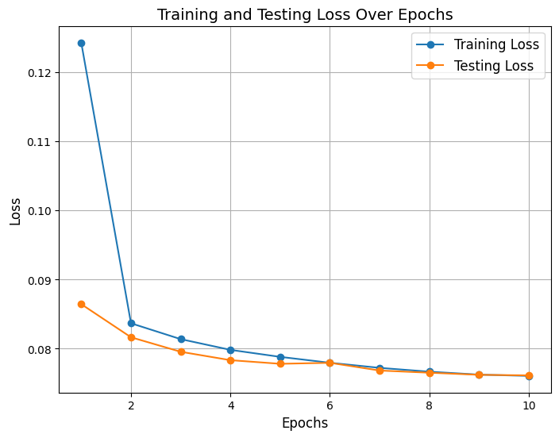
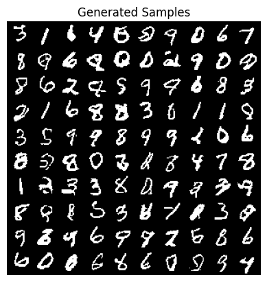

# PixelCNN on MNIST: Autoregressive Image Generation

## Project Overview
This project implements an autoregressive generative model (PixelCNN) on the MNIST dataset of handwritten digits. The goal is to model the distribution of pixel intensities and generate new, realistic digit images pixel by pixel.

**NOTE:** All the implementation and experiments for the PixelCNN model on the MNIST dataset are located at `/notebooks/PixelCNN-MNIST.ipynb`.

## Mathematical Background
Autoregressive models factorize the joint probability distribution into a product of conditional distributions:

$$ P(x) = \prod_i P(x_i | x_{1:i-1}) $$

Where each pixel is conditioned on all previous pixels in raster scan order (top to bottom, left to right).
The structure can be visualized as:

    

## Model Architecture
The PixelCNN architecture uses masked convolutions to enforce the autoregressive property:

- **Masked Convolutions**: Two types of masks ensure proper conditioning:
    - **Mask A**: Blocks current and future pixels (used in first layer)
    - **Mask B**: Blocks only future pixels (used in subsequent layers)

- **Network Structure**:
    - Input → Mask A 7×7 conv → 6×(Mask B 7×7 conv + ReLU) → 1×1 conv → Sigmoid output
    - Hidden channels: 64

The key innovation is that each pixel only has access to previously generated pixels, preserving the autoregressive property during both training and generation.

## Training Process
- **Data Prep**: MNIST, binarized via threshold 0.5.  
- **Optimizer**: Adam (lr=1e-3)  
- **Loss**: Binary Cross-Entropy  
- **Batch size**: 64, **Epochs**: 10  
- **Evaluation**: Track training and test loss each epoch.

## Results
The model was trained for 10 epochs, with careful monitoring of both training and test loss.
| Epoch | Train Loss | Test Loss |
|------:|-----------:|----------:|
|    10 | 0.0761     | 0.0764    |

Training loss decreased from 0.1243 to 0.0761, while test loss improved from 0.0864 to 0.0764, indicating good generalization without overfitting.

    

**Generated samples:**

    

The model quickly converges in early epochs and produces recognizable digit shapes, indicating strong autoregressive modeling of pixel dependencies.

## References
- [van den Oord et al., "Conditional Image Generation with PixelCNN Decoders," 2016, arXiv:1606.05328](https://arxiv.org/abs/1606.05328)  
- [LeCun et al., "MNIST Handwritten Digit Database," 1998](http://yann.lecun.com/exdb/mnist/)  
